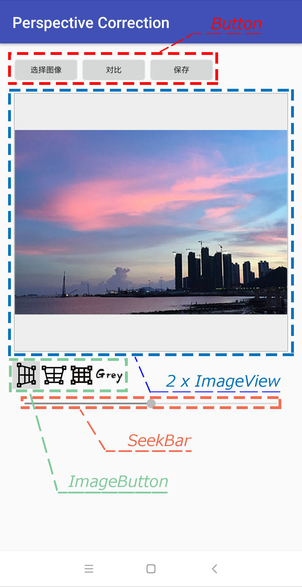

## 一. 整体框架

跨年回来，终于感觉可以有点时间写点什么东西，于是把折腾了一阵子的一个用OpenCV搞的东西拿出来记录一下，搞这个的目的一是发现有的P图应用里面连个透视矫正都没有还P个什么图，看着不别扭么，另外一个原因就是对Adobe家的自动矫正技术还蛮好奇是怎样实现的，于是整个工程的整体框架基于github项目[OpenCV_native](https://github.com/xiaoxiaoqingyi/NDKDemos) ，该项目主要介绍了在Android中接入使用OpenCV的三种方式，但是感觉都不是很友好，可能是用惯了python这种语言，然后发现在Android里面用个OpenCV如此麻烦，也是感觉心累。

## 二. 界面的设计

这边主要介绍的是怎样实现，于是界面什么的就一切从简了，并且能够节能减排。大致就如下图所示了：



极简吧，接下来复习一下控件的操作。

## 三.控件的操作

这里用这些控件元素要注意的点有如下一些，好久没写Android界面的我也是复习一下：

1. 屏幕旋转之后，要防止Activity的资源被销毁

> 这里使用的是将公共元素放到Application类中以防止丢失的办法解决的

2. “选择图像”调用的逻辑，这里包括了存储权限的获取、获得回调返回的图像数据、获得图像数据后图像发生旋转的问题

> 下面来逐一说明一下以上几个要点，首先关于存储权限的获取，说到权限自然要在manifest里面加上以下二货：
> ```xml
>     <uses-permission android:name="android.permission.READ_EXTERNAL_STORAGE" />
>     <uses-permission android:name="android.permission.WRITE_EXTERNAL_STORAGE" />
> ```
> 然后要在Activity里面加上判断是否已经获取到了存储权限的代码，如果没有获得存储权限那就要向用户要权限，不然怎么拿到图片？
> ```java
>    public static boolean isGrantExternalRW(Activity activity) {
>        if (Build.VERSION.SDK_INT >= Build.VERSION_CODES.M && activity.checkSelfPermission(
>                Manifest.permission.WRITE_EXTERNAL_STORAGE) != PackageManager.PERMISSION_GRANTED) {
>            activity.requestPermissions(new String[]{
>                    Manifest.permission.READ_EXTERNAL_STORAGE,
>                    Manifest.permission.WRITE_EXTERNAL_STORAGE
>            }, PERMISSIONS_CODE);
>            return false;
>        }
>        return true;
>    }
> ```

*To be continue...*